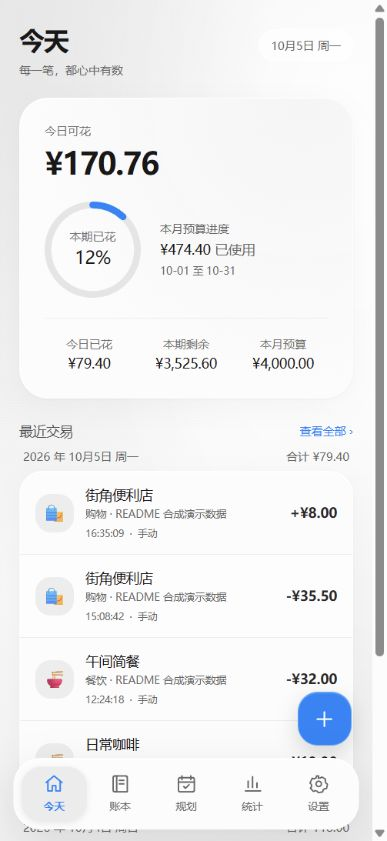
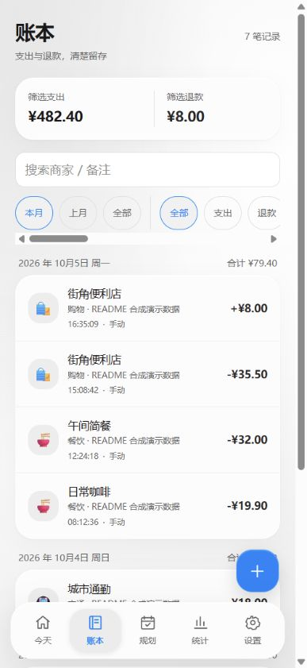
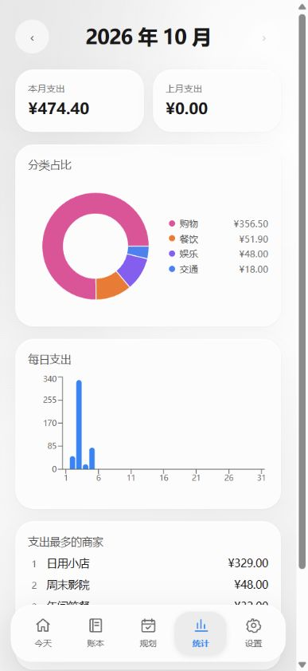
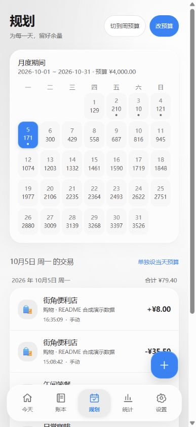
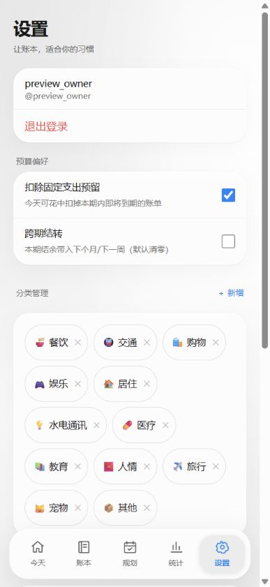
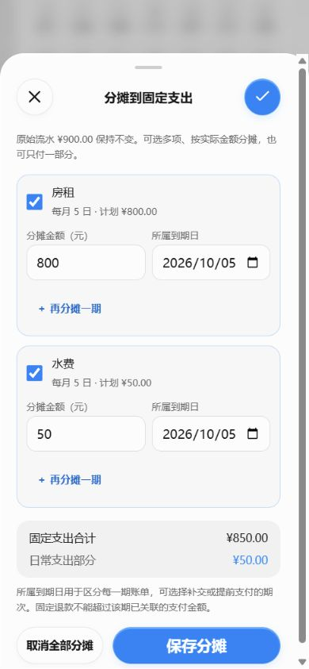
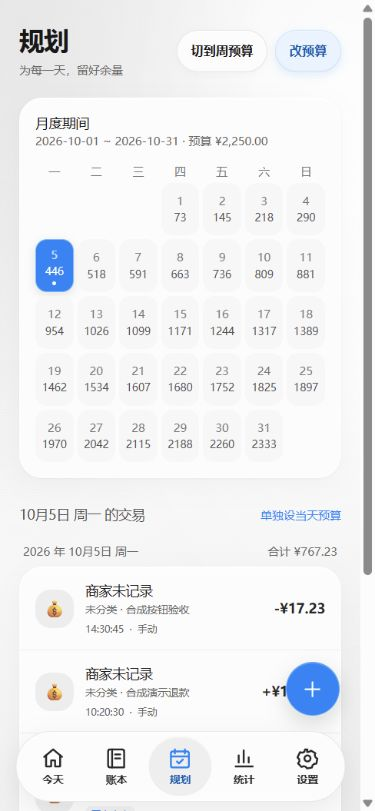
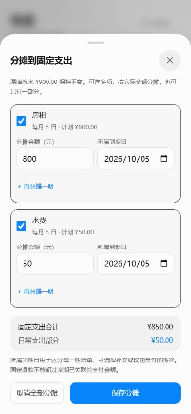

# 记账本 · jizhang-pwa


中文、个人自托管的预算记账 PWA。看清今天还能花多少，记录支出与退款，用 iPhone 快捷指令接入支付通知或截图文字。

界面采用黑白灰玻璃卡片、蓝色主要按钮与预算圆环、红色危险操作，保留彩色分类与图表。弹窗使用浅色玻璃圆形关闭按钮和蓝色圆形确认按钮，常用操作采用胶囊按钮。主屏幕图标为纯色 2D 账本标识。

**当前架构：React + Fastify + MySQL 8。** 账目保存在自己的服务器，生产模式一个端口同时提供网页和 API。当前是固定单用户应用，注册关闭，没有离线写入队列。

[GitHub 仓库：Bookkeeping-Assistant](https://github.com/Audreator/Bookkeeping-Assistant)

## 目录

- [界面预览](#界面预览)
- [功能与边界](#功能与边界)
- [固定支出分摊](#固定支出分摊)
- [第一次运行](#第一次运行)
- [在 iPhone 上使用](#在-iphone-上使用)
- [快捷指令配置](#快捷指令配置)
- [收单接口参数](#收单接口参数)
- [测试与开发](#测试与开发)
- [部署更新与备份](#部署更新与备份)
- [公开 GitHub 与隐私](#公开-github-与隐私)
- [项目结构与文档](#项目结构与文档)

## 界面预览

以下为手机宽度的实际网页截图，全部使用独立测试库的**合成演示数据**。商家、金额、日期、时间和 `preview_owner` 均不对应个人账目；没有真实账号、密码、收单令牌或服务地址。

首页展示今日可花与蓝色预算圆环，账本展示支出/退款和秒级时间，统计页保留彩色分类图表。

<p>
  
  
  
</p>

规划页可按日设置预算；设置页管理分类、固定支出和数据备份。

<p>
  
  
</p>

弹窗左上角「×」关闭，右上角蓝色「✓」保存或确认；不可操作时为灰色。底部保留同功能的文字胶囊按钮，便于首次使用。主要按钮触控区域至少 44px，删除使用红色标识。按钮样式调整不改变预算、固定分摊或快捷指令接口。

底部五个入口放在悬浮玻璃胶囊中，当前页以浅灰圆角底与蓝色图标、文字标识；菜单随页面滚动保持可用，并避开手机底部安全区和「记一笔」按钮。




## 功能与边界

| 页面 / 能力 | 当前功能 |
|---|---|
| 今天 | 今日可花、结转、超支、本期已花与固定支出预留 |
| 账本 | 支出/退款、新增编辑删除、分类筛选、商家与备注搜索、秒级时间、真实付款多项固定分摊 |
| 规划 | 月/周预算、预算调整、月历、指定某一天预算 |
| 统计 | 分类图表、每日净支出、期间对比、商户统计 |
| 设置 | 分类管理、固定支出、微信/支付宝 CSV 导入、JSON 与加密备份 |
| 快捷指令 | 通知正文、截图 OCR、手工结构化支出/退款；独立令牌鉴权 |
| 邮件 | 可选 IMAP 银行邮件轮询、收据审计与重复保护 |
| 手机桌面 | Safari 添加到主屏幕、Apple/PWA 图标、HTTPS 下静态资源缓存 |

每日额度可以结转，超支形成负结余，日常退款补回预算。固定预算由本期实际固定净付款和本期到期未覆盖计划组成，从总预算预留后重算每日额度，真实固定付款不再重复扣日常。首页日常预算与统计的实际完整流水各有明确口径。

以下边界需要在使用前了解：

- PWA 自身不能读取微信、支付宝或银行 App 的通知；需要快捷指令或服务器邮件通道提供内容。
- 文本要求明确已完成且金额无歧义，失败与处理中不入账。按当前规则，普通收入/收款/转入记为 `refund`；需要自己核对用途，不会自动把它关联为某项固定退款。
- 商家没有明确字段时保持空，显示「商家未记录」，不把银行、财付通或摘要猜成商家。
- 有消息交易时间就使用消息时间，没有则使用接口接收时间；显式 `date/time` 参数优先。分钟来源补 `:00`，不代表来源提供了真实秒数。
- 旧账目、CSV、邮件的未知历史时间可以为空，不用数据库创建时间伪造。
- 稳定 `eventId` 能保护同一事件的重试；缺少交易号、时间等信息的多笔同额交易不能保证完全区分，也没有跨所有来源的统一自动对账。
- 没有离线写入/补发队列、Web Push 或已部署 Cloudflare Worker。电脑关机或休眠、服务器断网时不能记账。

## 固定支出分摊

银行卡付款 900 元，实际包含房租 800、水费 50、日常 50：先在「设置 → 固定支出」建立账单，再点开账本里的原付款，选择「分摊到固定支出」，为房租和水费各填金额、所属到期日并保存。日常预算只扣 50 元，统计仍保留真实支出 900 元。

支持一笔多项、同账单分次付款、一次付数月、超计划付款、调整/撤销和明确固定退款。跨期预付不重复预留；有关联的账单可停用，不能直接删掉历史。快捷指令原请求不需要修改。完整操作、预算规则、退款、备份和接口见 [固定支出指南](docs/guides/fixed-expenses.md)。



## 第一次运行

### 1. 准备环境

- Node.js 24 与 npm。
- Docker Desktop / Docker Engine 和 Compose，用于 MySQL。
- 本地开发使用 Windows PowerShell；Linux/macOS 的复制文件命令可换成 `cp`。

下载源码或克隆自己的仓库，在项目根目录执行：

```powershell
git clone https://github.com/Audreator/Bookkeeping-Assistant.git
cd Bookkeeping-Assistant
npm ci
Copy-Item .env.example .env
```

若使用源码 ZIP，解压后直接在解压目录执行 `npm ci` 和首次配置步骤，无需再克隆。

**已有 `.env` 时不要覆盖。** 用编辑器修改这个只保存在自己电脑的文件。

### 2. 填写私密配置

| 变量 | 配置方式 |
|---|---|
| `MYSQL_ROOT_PASSWORD` | 自己生成的数据库管理员密码 |
| `MYSQL_PASSWORD` | 应用数据库用户密码；与下面两条连接地址一致 |
| `DATABASE_URL` | 正式库连接，默认库名 `jizhang` |
| `TEST_DATABASE_URL` | 独立测试库连接，默认 `jizhang_test`；测试会清理此库 |
| `JWT_SECRET` | 随机长字符串，用于网页登录令牌 |
| `DEFAULT_USERNAME` | 自己的固定登录用户名，示例是通用的 `owner` |
| `DEFAULT_PASSWORD` | 自己的强登录密码，启动时创建账号或校正该账号密码 |
| `INGEST_TOKEN` | 独立随机收单令牌，手机快捷指令请求头使用 |
| `INGEST_USER` | 可选数字用户 ID；单用户模式省略时选择第一个用户 |
| `PORT` / `TZ` | 默认 `8787` / `Asia/Shanghai` |

生成一个随机值的方法如下；分别运行，为不同用途使用不同值，只复制到自己的配置中：

```powershell
node -e "console.log(require('node:crypto').randomBytes(32).toString('hex'))"
```

数据库连接示例中的 `change-me` 必须替换，并与 `MYSQL_PASSWORD` 一致。采用随机十六进制密码可避免连接 URL 中特殊字符的转义问题；其他密码需按 URL 规则编码。

IMAP 配置是可选的，首次运行保持空。邮箱授权码与登录密码不是同一种凭据，见 [QQ IMAP 指南](docs/guides/qq-imap.md)。

### 3. 启动

先启动 Docker，再执行：

```powershell
npm run db:up
npm run db:migrate
npm run build
npm run start
```

浏览器打开 `http://localhost:8787`，使用 `.env` 中的 `DEFAULT_USERNAME` 和 `DEFAULT_PASSWORD` 登录。健康检查是 `GET /api/health`。

默认 Compose 仅向本机发布 MySQL 的 `127.0.0.1:3306`。首次创建数据库卷时会初始化 `jizhang` 与 `jizhang_test`；已有卷不会重新执行初始化脚本。这里的数据库名和用户若要修改，应同步连接地址、初始化与权限，不能仅改一处配置。

生产模式需要保持启动服务的进程运行。正常停止 `db:down` 不删除数据卷；不要执行删除卷的命令来升级项目。

## 在 iPhone 上使用

### 同一 Wi-Fi / 局域网

1. 电脑保持 MySQL 与 `npm run start` 运行，手机连接同一可互通网络。
2. 电脑执行 `ipconfig`，找到当前联网网卡的 IPv4。
3. iPhone **Safari** 输入 `http://电脑的局域网IP:8787`，换成实际 IP。手机上的 `localhost` 指手机自身，不能访问电脑。
4. 用自己的固定账号登录。应用不提供注册入口；在新设备登录会使旧设备会话失效。
5. Safari 点分享按钮 →「添加到主屏幕」→ 命名「记账本」→ 添加。之后从桌面的 2D 图标打开。
6. 在「规划」设置预算，在「设置」管理分类与固定支出，再用首页的记账入口新增支出或退款；「账本」可核对、编辑或删除。

首次手工新增一笔小额测试记录，确认日期、金额与时间，再删除它。添加图标后显示旧图标，可移除旧入口并重新添加；账目仍保存在服务器。

更新后刷新或重新打开入口以加载新构建。新版本遇到页面资源加载失败会显示「刷新页面」提示；旧缓存页面出现空白时先手动刷新，不需要清空账号/本地存储或删除服务器账目。

如果手机打不开网页，检查电脑服务、正确 IPv4、防火墙允许 Node/8787 在自己的网络入站，以及路由器是否开启设备隔离。电脑 IP 变动后，桌面入口与快捷指令 URL 都需要更新；可在路由器配置固定租约。

### 外出与 PWA

局域网地址在蜂窝网络下通常不可达。外出使用需要自己可访问的 HTTPS 服务或安全网络，见 [云部署指南](docs/guides/cloud-deploy.md)。公网访问启用 HTTPS，不直接暴露 MySQL。

手机局域网 HTTP 可以使用在线网页与普通 JSON 备份；Service Worker 和加密备份需要安全上下文，通常为 HTTPS（开发机 `localhost` 例外）。静态缓存不代表账本能离线写入，网络失败需要恢复后自己重试。

## 快捷指令配置

**先跑通手动测试，再接通知或截图。** 下文所有金额、商家、事件 ID 都是合成示例，会向自己的账本写入测试记录；测试完成后可删除。

### 1. 新建「记账接口测试」

1. 电脑在 `.env` 配置随机 `INGEST_TOKEN`，停止旧服务并重启。已有令牌直接使用，无需为了测试更换。
2. 手机打开「快捷指令」App，点 `+` 新建快捷指令，命名「记账接口测试」。
3. 添加「文本」动作，填入：

   ```text
   支付成功
   实付金额：¥1.23
   商户：接口测试商店
   支付时间：2026-10-04 12:34:56
   ```

4. 添加「获取 URL 内容」，地址为 `http://电脑的局域网IP:8787/api/ingest/ocr`。HTTPS 部署则使用 `https://自己的域名/api/ingest/ocr`。
5. 展开动作设置，按下表填写：

   | 设置 | 内容 |
   |---|---|
   | 方法 | `POST` |
   | 标头名称 | `x-ingest-token` |
   | 标头值 | 电脑 `.env` 的 `INGEST_TOKEN` **值**，不含键名或引号 |
   | 请求体 | `JSON` |
   | 字段名称 | `text` |
   | 字段类型 | 「文本」 |
   | 字段值 | 点变量选择第 3 步「文本」动作的输出 |

6. 可增加文本字段 `eventId`，值为 `shortcut-demo-payment-001`，重复测试保持相同值。
7. 添加「显示结果」，输入选择「获取 URL 内容」的返回值；运行，允许访问自己的服务器。
8. 返回应含 `duplicate: false` 与 `message`。打开「账本」核对测试商店、支出 1.23 元、日期和 `12:34:56`。再次运行应为 `duplicate: true`，不会新增第二笔。

发送的最简 JSON 是下面的结构。**在请求体表格里添加字段即可，不要把整段 JSON 填到 `text` 的值里，也不要把真实令牌写进请求体。** 「获取 URL 内容」会负责引号和换行编码。

```json
{
  "text": "支付成功\n实付金额：¥1.23\n商户：接口测试商店\n支付时间：2026-10-04 12:34:56",
  "eventId": "shortcut-demo-payment-001"
}
```

退款测试改为下面的文本，并换一个 `eventId`，例如 `shortcut-demo-refund-001`：

```text
退款成功
退款金额：¥1.23
商户：接口测试商店
退款时间：2026-10-04 12:35:01
```

退款应单独记录；「退款申请」「退款处理中」「退款失败」应拒绝入账。测试日期是固定示例，日常需要实际交易日期。

### 2. 实时通知自动化

系统版本、App 和权限决定通知触发器及正文是否可用。iOS 27 的 Apple 官方指南已列出通知事件，可按 App、标题、副标题或信息筛选，见 [Apple 事件触发器](https://support.apple.com/guide/shortcuts/apd932ff833f/10.0/ios/27)。入口名称与可用选项以手机实际系统为准。

1. 在快捷指令的自动化入口选择「通知」，指定银行、微信或支付宝 App，按明确完成支付/退款的文案筛选。
2. 先添加「显示结果」，查看自动化输入是否包含通知正文；不能仅凭 App 打开、普通聊天或营销提示确认交易。
3. 沿用上面的「获取 URL 内容」配置，`text` 的值选择通知的「信息/正文」。如果选择到通知对象，可加「从输入中获取文本」后使用它的输出；接口也接受 `title/body/message/信息` 等已知通知对象字段。
4. 默认**不传 `date` 和 `time`**：消息有交易时间就使用消息时间，没有时采用服务器接收时刻，精确到秒。这样不会把当前时间覆盖历史截图。
5. 有真实来源交易号时，以来源名和交易号组成稳定 `eventId`。付款与退款使用不同 ID，同一次事件重试继续用原 ID。
6. 初期保留「显示结果」或「显示通知」，确认实际返回；验证通过后再按系统提供的选项设置自动运行和锁屏权限。

银行「出账 / 网联支出」「发生快捷支付扣款」的匿名模板已有测试；当前「账户入账」「收入」也按 `refund` 入账，这是既有统一进账规则，不能证明它是实际退款。自行核对用途，只有明确退回固定款时才在账本分摊到对应账单；工资等普通进账无需指定固定退款。

通知正文为空或对象无法提取时会返回 `400` 和 `inputShape`。先将通知变量转换为正文文本；诊断结构可用于排查，真实通知、卡号和令牌不公开。完整步骤见 [快捷指令指南](docs/guides/shortcut-ocr.md)。

### 3. 当前屏幕与历史截图 OCR

- **当前支付详情**：快捷指令添加「截屏」→「从图像中提取文本」→上述 POST，`text` 选择提取文字的输出 →「显示结果」。iPhone 设置 → 操作按钮 → 快捷指令，选择它；也可绑定轻点背面。
- **历史截图**：用分享菜单接收图像或「选择照片」，再提取文本并 POST，不能在相册分享历史截图时重新截屏代替原图。分享输入/多图处理与权限详见 [完整指南](docs/guides/shortcut-ocr.md)。

截图应包含一笔交易的成功/到账详情、金额与日期时间，避免把多笔通知一起提交。没有商家可以为空。历史截图缺少日期/年份时自行填写正确 `date`；时间无法确定时请人工核对，不要为了绕过去重而加入随机时间。

### 4. 手动金额快捷指令

已有自己确认的类型与金额时，可以用菜单「支出/退款」→「询问输入」金额 →调用 `POST /api/ingest/transaction`，请求头同上：

```json
{
  "type": "expense",
  "amount": "35.50",
  "merchant": "便利店",
  "note": "手动快捷指令",
  "eventId": "manual-example-001"
}
```

`type` 支出填 `expense`、退款填 `refund`；金额为正数元，最多两位小数。未知商家省略 `merchant`。本例省略日期时间，使用接收时刻；补历史账目时传真实 `date/time`。

首次事件可生成 UUID 并保存，网络重试继续使用同一个 UUID；每次重试新生成 ID 会造成重复。这条接口不判断真实付款是否成功，调用方要先确认。

### 返回结果与排障

| 返回 / 现象 | 含义与处理 |
|---|---|
| `201` / `duplicate: false` | 新交易已写入，到账本核对 |
| `200` / `duplicate: true` | 已记过，返回原交易 |
| `400` | 字段/日期/时间格式不正确，或通知正文为空；查看 `invalidFields` / `inputShape` |
| `401` | `x-ingest-token` 不正确或未传，核对手机与 `.env`，修改后重启服务器 |
| `409` | 同一事件 ID 用于不同内容，核对交易号；不能用原付款 ID 发送退款 |
| `422` | 缺明确完成状态或唯一金额，换详情页或手工确认后记账 |
| `503` | 服务器未配置收单令牌或可用入账账号 |
| 网络无法连接 | URL、同局域网、防火墙、电脑休眠；外出需可达 HTTPS 服务 |
| 超时后不确定是否入账 | 查询账本，或保持同一 `eventId` 重试；不要直接再建新事件 |

## 收单接口参数

手机不需要数据库密码和网页登录 JWT，只需要自己的独立收单令牌。推荐 JSON 请求体，令牌放 `x-ingest-token` 请求头；不要放 URL 参数。

| 字段 | 文本 `/api/ingest/ocr` | 结构化 `/api/ingest/transaction` |
|---|---|---|
| `text` | 必填，1–5000 字或受支持的通知对象 | 不使用 |
| `type` | 从文本判断 | 必填，`expense` / `refund` |
| `amount` | 从文本判断 | 必填，正数元、最多两位小数 |
| `date` | 可选，`YYYY-MM-DD`，覆盖文本日期 | 可选，缺省接收日期 |
| `time` | 可选，`HH:mm:ss`，覆盖文本时间 | 可选，缺省接收时间 |
| `eventId` | 可选，1–128 字，建议稳定来源 ID | 同左 |
| `merchant` / `note` | 商家从明确字段提取 | 可选，最长 128 / 256 字 |

`time` 也兼容 `HH:mm` 并补 `:00`。日期、时间不含时区偏移，当前部署按 `Asia/Shanghai` 业务时区处理。响应包含 `message` 和 `transaction`，交易日期为 `occurredAt`，秒级时间为 `occurredTime`。

完整鉴权、通知对象、跨午夜重试、冲突、并发、普通交易 `requestId` 与错误码见 [收单 API 合约](docs/guides/ingest-api.md)。

## 测试与开发

### 全量检查

先启动 MySQL，配置独立 `TEST_DATABASE_URL`。**库名必须以 `_test` 结尾且不能与正式库相同；集成测试会清理测试数据，不回退正式 `DATABASE_URL`。**

```powershell
npm run typecheck
npm run test:run
npm run lint
npm run build
```

单独运行前端和服务端：

```powershell
npm run test:run -- src --exclude 'server/**'
npm run test:run -- server
```

前端排除参数是必要的，因为 `server/src` 路径同样包含 `src`。

2026-10-05 固定分摊迭代验证：前端 **20 个文件 / 157 个测试**，服务端 **11 个文件 / 288 个测试**，合计 **445 个测试全部通过**。新增多项/部分付款、固定退款、发生日期覆盖、并发修改、越权和新旧备份回归；另完成 22 次真实 HTTP 冒烟与手机宽度网页操作。独立审查发现的问题修复后再次复查通过。类型检查、lint 和生产构建通过；lint 保留一条既有 Fast Refresh 导出提示。更细的验证和真实设备边界见 [实施记录](docs/PROGRESS.md)。

自动测试与桌面移动宽度检查不等同于所有银行模板、通知锁屏、真实微信/支付宝退款、IMAP、云端 HTTPS 均已真机验收。遇到新模板，先写匿名失败测试，再改解析器。

### 开发命令

| 命令 | 用途 |
|---|---|
| `npm run dev:all` | 同时启动 Vite 5173 与 API 8787，Vite 代理 `/api` |
| `npm run dev -- --host` | 局域网前端开发；另启 `npm run dev:server` |
| `npm run start` | 生产服务，读取 `dist/` 并提供 API |
| `npm run preview` | 仅静态预览，不能代替 API |
| `npm test` | Vitest watch |
| `npm run db:up` / `db:down` | 启停本地 MySQL 容器 |
| `npm run db:generate` / `db:migrate` | 生成 / 应用版本化迁移 |
| `npm run email:dry` | 邮件诊断；输出可能含个人内容，不公开粘贴 |
| `node scripts/generate-icons.cjs` | 从 `public/logo.svg` 同步各尺寸图标 |

引擎、纯工具、支付与邮件解析遵循 TDD。页面数据访问统一经 `src/api/hooks.ts` 与 `client.ts`；服务端业务路由目前直接使用 Drizzle。

## 部署更新与备份

自有服务器可使用 `Dockerfile`、`compose.prod.yaml` 与 `Caddyfile`。复制 `.env.prod.example` 为私密 `.env`，配置域名、独立强密码与密钥，然后：

```bash
docker compose -f compose.prod.yaml up -d --build
```

Caddy 提供 HTTPS，数据库仅容器内网，应用容器先迁移再启动。此部署流程仍需在自己的目标服务器验证证书、权限、手机蜂窝访问及备份恢复，见 [云部署指南](docs/guides/cloud-deploy.md)。

更新已有服务时先备份、保留 `.env` 和数据库卷，再迁移、构建、重启；不要用删除数据库卷替代迁移。账号密码变化需重启服务，收单令牌变化需同时更新手机。

App 备份在「设置 → 数据」导出 JSON 或加密备份。加密依赖 HTTPS 安全上下文，普通 JSON 包含个人账目；恢复为追加式，重复恢复前确认已有数据。完整 MySQL 备份包含交易及邮件原文，只放自己的私密位置。命令、恢复与排障见 [维护手册](docs/MAINTENANCE.md)。

## 公开 GitHub 与隐私

公开仓库会公开源码。账号、密码、数据库和邮箱凭据、收单令牌、GitHub 上传 token、真实账单与截图应仅保留在自己的运行环境。

仓库只提供通用 `.env.example` / `.env.prod.example`，登录页不预填个人账号，秘密不以 `VITE_*` 注入前端。`.gitignore` 和 `.dockerignore` 排除真实 `.env`、依赖、构建、日志、本机工作目录、备份/导出/私密/发布目录及密钥文件。

**忽略规则不能清除已经存在的 Git 历史。** 曾存入历史的秘密即使在最新文件中删除，推送旧历史仍会公开。发布前检查全部历史；存在私密历史时，从经过检查的纯源码包创建全新仓库，不直接推送原仓库，也不把数据库、日志、截图或 `.env` 拖进去。

### 从干净源码包发布

1. 将审查后的源码 ZIP 解压到一个**新的目录**，不要覆盖现有运行项目。包内应只有源码、通用配置和文档，没有 `.git` / `.env` / `dist` / 数据备份。
2. GitHub 新建 **Public** 空仓库，首次不要自动生成 README，避免与本地首次提交冲突。
3. 在新的源码目录初始化 Git。若要隐藏个人邮箱，先在 GitHub 账号 Email 设置取得自己的 `noreply` 地址，在提交前配置 `git config user.email`；作者名也是公开元数据，按自己希望公开的身份配置。
4. 执行以下命令；下面是本项目目标仓库地址，发布到其他仓库时替换：

   ```bash
   git init -b main
   git add .
   git diff --cached --stat
   git commit -m "Initial public release"
   git remote add origin https://github.com/Audreator/Bookkeeping-Assistant.git
   git push -u origin main
   ```

5. 上传鉴权使用 GitHub 官方登录 / 系统凭据管理器，或在提示处提供自己的 token。不要把 token 写进 remote URL、源码、README、截图或快捷指令。第一次推送前检查暂存文件列表。

官方操作参考：[创建仓库](https://docs.github.com/en/repositories/creating-and-managing-repositories/creating-a-new-repository)、[提交邮箱与隐私](https://docs.github.com/en/account-and-profile/how-tos/email-preferences/setting-your-commit-email-address)、[GitHub 鉴权](https://docs.github.com/en/authentication/keeping-your-account-and-data-secure/about-authentication-to-github)。

也可以在 GitHub 网页上传解压后的源码文件与目录；选择文件时包含 `.gitignore`、`.dockerignore` 等必要配置，但不上传 ZIP 内不存在的本机私密文件。

秘密若已对外发布，应轮换相关值并同步部署/快捷指令，再处理远端历史。公开演示、Issue 和 PR 中的通知样本需用合成姓名、卡尾、金额、订单号，不粘贴原始通知或邮件。

## 项目结构与文档

```text
src/
  api/          API client、类型、Query hooks
  engine/       预算引擎与测试
  lib/          日期、CSV、备份、统计与测试
  pages/        今天 / 账本 / 规划 / 统计 / 设置 / 登录
  components/   记账弹窗、交易、日历、导航等
  state/        登录态与预算数据组装
server/
  src/db/       Drizzle schema、MySQL 与测试库保护
  src/routes/   登录业务 API 与令牌收单 API
  src/ingest/   支付/退款、时间与通知对象解析
  src/email/    IMAP、银行邮件解析与收据审计
  drizzle/      版本化 SQL 迁移
public/         SVG、Apple/PWA/favicon 图标
scripts/        图标生成
docs/           架构、维护、合约、使用指南与实施记录
workers/        中转设计预留，尚无可部署实现
```

| 文档 | 用途 |
|---|---|
| [快捷指令指南](docs/guides/shortcut-ocr.md) | 手机逐动作配置、历史截图、通知、手动入账与排障 |
| [手机局域网指南](docs/guides/local-preview.md) | Safari、主屏幕、防火墙与网络边界 |
| [使用指南](docs/guides/usage.md) | 五页操作、预算、秒级记录与备份 |
| [收单 API](docs/guides/ingest-api.md) | 参数、返回码、时间优先级、事件 ID 与重试 |
| [ARCHITECTURE](docs/ARCHITECTURE.md) | 当前架构与数据流 |
| [MAINTENANCE](docs/MAINTENANCE.md) | 启动、迁移、更新、备份与排障 |
| [SECURITY](docs/SECURITY.md) | 登录、令牌、邮件与部署安全模型 |
| [ROADMAP](docs/ROADMAP.md) | 当前实现和后续能力 |
| [PROGRESS](docs/PROGRESS.md) | 自动检查、服务重启与真实设备验证记录 |
| [CSV 导入](docs/guides/bill-export.md) | 微信/支付宝导出与核对 |
| [历史设计](docs/superpowers/specs/2026-10-04-jizhang-pwa-design.md) | 最初设计背景，不能作为当前功能清单 |

每轮迭代同步实施记录、架构和受影响指南；真实凭据、交易原文与备份不进入 Git。
